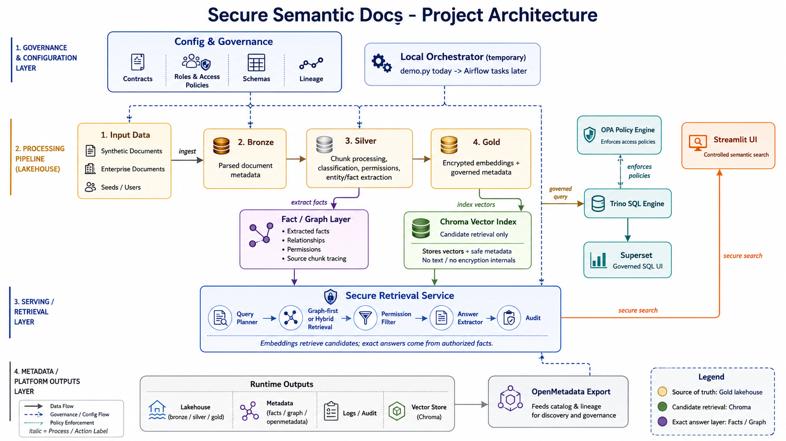

# Architecture

## Overview

Secure Semantic Docs uses a medallion lakehouse with two governed access paths.
Raw source documents land in the repository, move through Bronze, Silver, and Gold parquet layers, and are then exposed
either through controlled semantic retrieval or through governed SQL views.

The core security rule is constant across the stack:

**Filter first. Decrypt second. Search third. Audit always.**



## Component table

| Component    | Role                                                    | Port | Technology               |
|--------------|---------------------------------------------------------|-----:|--------------------------|
| Iceberg REST | Local catalog and warehouse endpoint                    | 8181 | Tabular Iceberg REST     |
| Trino        | Governed SQL engine over safe views                     | 8080 | Trino 468                |
| OPA          | Policy service for future SQL authorization integration | 8181 | Open Policy Agent        |
| Superset     | SQL exploration and dashboards over safe views          | 8088 | Apache Superset          |
| Streamlit    | Controlled semantic retrieval UI                        | 8501 | Streamlit                |
| Pipeline     | Bronze, Silver, Gold generation                         |  n/a | Python 3.14, PySpark 4.1 |
| Audit log    | Access and retrieval trail                              |  n/a | JSONL                    |

## End-to-end diagram

```text
Landing Documents
    |
    v
Bronze Documents
    |
    v
Silver Chunks
    |
    v
Gold Encrypted Embeddings
   /   v   v
Trino Governed Views   Secure Retrieval Service
  |                     |
  v                     v
Superset SQL UI     Streamlit Governed UI
   \                 /
    v               v
        Audit Log
```

## Data flow by layer

### Landing

Landing contains the raw documents and source metadata used to build the lakehouse. It is not a user-facing layer.

### Bronze

Bronze stores document metadata and provenance. It is the first persisted layer and records ownership, classification,
allowed roles, version, and ingestion timestamp.

### Silver

Silver stores chunk-level governance metadata without plaintext chunk content. It carries sensitivity scores, role
constraints, and document linkage.

### Gold

Gold stores encrypted embeddings and encryption metadata. Safe SQL views never expose ciphertext, nonce, or key
identifiers.

## Two UI paths

### Streamlit retrieval path

Streamlit is the controlled application path. Users do not write SQL. The app filters candidate chunks by permissions,
decrypts only authorised embeddings, performs semantic search, and records the action in the audit log.

### Superset SQL path

Superset is for governed SQL exploration and dashboards. It connects only to Trino safe views. It does not perform
semantic search and does not decrypt embeddings.

## Security boundaries

- `lakehouse.raw` is admin-only and may include internal or encrypted fields.
- `lakehouse.safe` is the only SQL schema intended for general users.
- Trino governs SQL access and Superset exposes only governed datasets.
- Streamlit can retrieve authorised semantic results but cannot run raw SQL.
- OPA policy documents blocked columns and role mappings for future enforcement.
- Audit logging remains mandatory for governed retrieval activity.

## Future integrations

### Airflow pipeline orchestration

The local `demo.py` orchestrator mirrors an Airflow DAG structure. Each task function can
be lifted into an Airflow `@task` without rework. See
[future_airflow_integration.md](future_airflow_integration.md) for the mapping and a
minimal DAG sketch.

```text
Airflow DAG: secure_semantic_docs_pipeline
  ├── prepare_runtime_dirs  (required)
  ├── validate_configuration  (required)
  ├── validate_input_data  (required)
  ├── bronze_ingestion  (required)
  ├── silver_ingestion  (required)
  ├── gold_ingestion  (required)
  ├── build_graph_or_facts  (optional)
  ├── sync_chroma_index  (optional)
  ├── export_openmetadata  (optional)
  └── quality_checks  (optional)
```

### Text model / RAG query

The serving layer includes a `build_text_model_context()` hook that assembles a
permission-filtered, sanitized context bundle for a text model. Text model integration
is disabled by default. See [future_text_model.md](future_text_model.md) for the full
query flow, proposed module structure, and security requirements.

```text
Future query flow (text model enabled):
  User query
    → authenticate
    → fact search (exact, permission-filtered)
    → semantic candidate retrieval
    → permission filter + sanitize
    → build_text_model_context()
    → load_authorized_chunk_text() [reviewed context source]
    → call_text_model()
    → grounded answer + source references
    → audit
```
